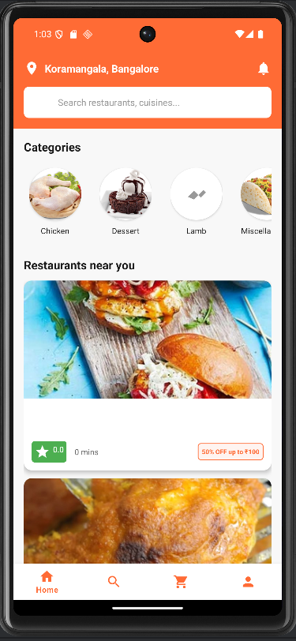
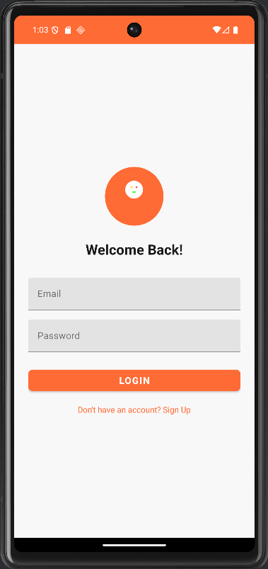
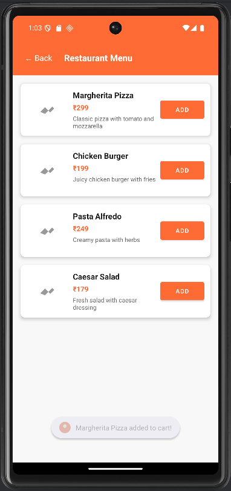
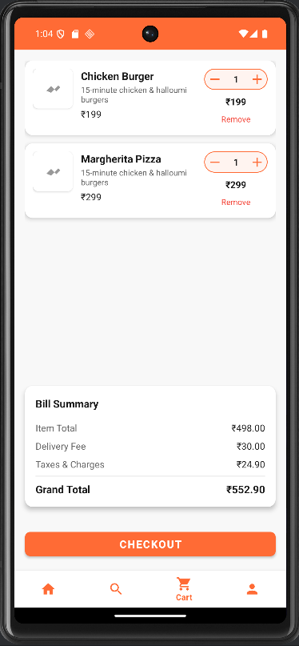
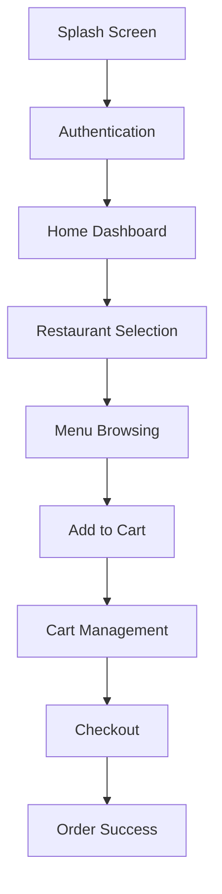

# 🍕 Foodify - Food Delivery App

<div align="center">
  
  
  
  
  
</div>

<div align="center">
  <h3>🚀 A Complete Food Delivery Android Application</h3>
  <p>Built with modern Android development practices, featuring real-time food ordering, cart management, and seamless user experience similar to Swiggy/Zomato.</p>
</div>

---

## 📱 Screenshots

<div align="center">
  
  
  
  
</div>

## ✨ Features

### 🎯 Core Functionality
- **🔐 User Authentication** - Secure login/signup with data persistence
- **🏠 Home Dashboard** - Browse food categories and nearby restaurants
- **🍽️ Restaurant Menus** - Detailed food items with prices and descriptions
- **🛒 Smart Cart Management** - Add, remove, and modify cart items with real-time updates
- **💳 Checkout Process** - Complete order placement with address and payment selection
- **📍 Location Services** - Integration with maps for delivery tracking

### 🎨 UI/UX Excellence
- **📱 Material Design** - Modern, intuitive interface following Google's design guidelines
- **🌟 Smooth Animations** - Lottie animations and seamless transitions
- **💀 Skeleton Loading** - Professional loading states for better UX
- **🎭 Adaptive Icons** - Custom food delivery themed app icon
- **📐 Responsive Design** - Optimized for different screen sizes

### 🏗️ Technical Architecture
- **🏛️ MVVM Pattern** - Clean separation of concerns
- **🗄️ Room Database** - Local data persistence for cart and user data
- **🌐 Retrofit Integration** - RESTful API communication
- **📊 LiveData & ViewBinding** - Reactive UI updates and type-safe view references
- **🗺️ Maps Integration** - OpenStreetMap with PositionStack geocoding

## 🛠️ Tech Stack

| Category | Technology |
|----------|------------|
| **Language** |  |
| **Architecture** |  |
| **Database** |   |
| **Networking** |   |
| **UI Components** |   |
| **Image Loading** |  |
| **Animations** |  |
| **Maps** |   |

## 🚀 Getting Started

### Prerequisites
- **Android Studio** Arctic Fox or later
- **JDK 11** or higher
- **Android SDK** with minimum API level 24
- **Git** for version control

### 📥 Installation

1. **Clone the repository**
   ```bash
   git clone https://github.com/mr-piyushkr/Foodify-Android-App.git
   cd Foodify-Android-App
   ```

2. **Open in Android Studio**
   - Launch Android Studio
   - Select "Open an existing project"
   - Navigate to the cloned directory

3. **Sync dependencies**
   ```bash
   ./gradlew build
   ```

4. **Run the application**
   - Connect an Android device or start an emulator
   - Click the "Run" button in Android Studio

## 🔧 Configuration

### API Keys Setup
Add your API keys to `Constants.java`:

```java
// Foursquare API for restaurant data
public static final String FOURSQUARE_API_KEY = "YOUR_FOURSQUARE_API_KEY";

// PositionStack API for geocoding
public static final String POSITIONSTACK_API_KEY = "YOUR_POSITIONSTACK_API_KEY";
```

### Database Configuration
The app uses Room database which is automatically configured. No additional setup required.

## 📁 Project Structure

```
com.piyush.foodify/
├── 📁 ui/
│   ├── 📁 activities/          # Activity classes
│   ├── 📁 fragments/           # Fragment classes
│   └── 📁 adapters/           # RecyclerView adapters
├── 📁 data/
│   ├── 📁 model/              # Data models
│   └── 📁 repository/         # Repository pattern implementation
├── 📁 database/               # Room database components
├── 📁 network/                # API interfaces and clients
├── 📁 viewmodel/              # ViewModel classes
└── 📁 utils/                  # Utility classes and constants
```

## 🌐 API Integration

### TheMealDB API
- **Base URL**: `https://www.themealdb.com/api/json/v1/1/`
- **Purpose**: Food categories and meal data
- **Rate Limit**: Free tier available

### Foursquare Places API
- **Purpose**: Restaurant location data
- **Authentication**: API key required
- **Features**: Restaurant search and details

### PositionStack API
- **Purpose**: Address geocoding
- **Features**: Convert addresses to coordinates
- **Rate Limit**: 25,000 requests/month (free tier)

## 🎯 App Flow



## 🧪 Testing

### Manual Testing Checklist
- [ ] App launches without crashes
- [ ] Authentication flow works correctly
- [ ] API data loads properly
- [ ] Cart functionality operates smoothly
- [ ] Database persistence works
- [ ] UI responds correctly to user interactions

### Test Credentials
```
Email: any@email.com
Password: any_password
```
*Note: Authentication is currently implemented with dummy validation for demo purposes.*

## 🚀 Build & Release

### Debug Build
```bash
./gradlew assembleDebug
```

### Release Build
```bash
./gradlew assembleRelease
```

### APK Location
- **Debug**: `app/build/outputs/apk/debug/app-debug.apk`
- **Release**: `app/build/outputs/apk/release/app-release-unsigned.apk`

## 🤝 Contributing

1. **Fork** the repository
2. **Create** a feature branch (`git checkout -b feature/AmazingFeature`)
3. **Commit** your changes (`git commit -m 'Add some AmazingFeature'`)
4. **Push** to the branch (`git push origin feature/AmazingFeature`)
5. **Open** a Pull Request

### Code Style Guidelines
- Follow **Android coding standards**
- Use **meaningful variable names**
- Add **comments** for complex logic
- Maintain **consistent indentation**

## 📋 Roadmap

- [ ] 🔔 **Push Notifications** - Real-time order updates
- [ ] 🗺️ **Real-time Tracking** - Live delivery tracking
- [ ] 💳 **Payment Gateway** - Actual payment processing
- [ ] ⭐ **Reviews & Ratings** - User feedback system
- [ ] 🌍 **Multi-language Support** - Localization
- [ ] 🔐 **Social Login** - Google/Facebook authentication
- [ ] 📱 **Dark Mode** - Theme customization
- [ ] 🎯 **Recommendation Engine** - AI-powered suggestions

## 🐛 Known Issues

- Authentication is currently dummy implementation
- Payment processing is simulated
- Some API endpoints have rate limitations
- Maps require internet connection

## 👨‍💻 Author

**Piyush**
- GitHub: [mr-piyushkr](https://github.com/mr-piyushkr)
- LinkedIn: [Piyush Kumar](https://linkedin.com/in/piyushkumar06)
- Email: your.email@example.com

## 🙏 Acknowledgments

- **TheMealDB** for providing free food data API
- **Material Design** for UI/UX guidelines
- **Android Developer Community** for continuous support
- **OpenStreetMap** for free mapping services

## 📊 Project Stats

<div align="center">
  
  
  
</div>

---

<div align="center">
  <p>Made with ❤️ by <strong>Piyush</strong></p>
  <p>⭐ Star this repository if you found it helpful!</p>
</div>